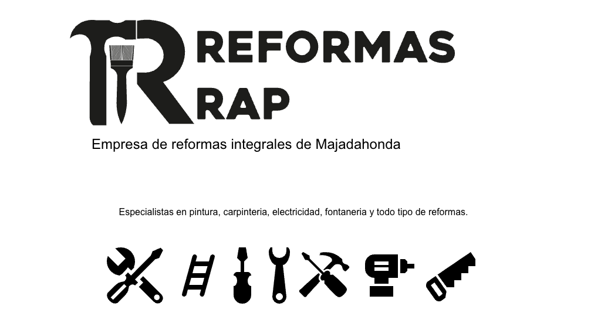

# 🛠️ Reformas RAP

## 🏠 Web para empresa de reformas en Majadahonda



***

### 🎯 Objetivo

El objetivo principal de esta plataforma es:
* Mostrar el catálogo de servicios (reformas integrales, cocinas, baños, etc.).
* Presentar proyectos realizados (portafolio).
* Facilitar la solicitud de presupuestos y el contacto con la empresa.
* Mejorar la presencia digital y el posicionamiento local en Majadahonda y alrededores.

***

### 🚀 Tecnología

La web está construida utilizando:

* **Frontend:** React con NextJS.
* **Estilos:** Tailwind CSS y CSS Modules.
* **Backend/CMS:** Strapi.

***

### 📦 Instalación y Ejecución Local

Para levantar el proyecto en tu entorno local, sigue los siguientes pasos:

1.  Clona el repositorio:
    ```bash
    git clone https://github.com/rogerparada/reformas-rap
    ```
2.  Navega al directorio del proyecto:
    ```bash
    cd reformas-rap
    ```
3.  Instala las dependencias:
    ```bash
    pnpm install
    ```
4.  Ejecuta el servidor de desarrollo:
    ```bash
    pnpm run dev
    ```

El sitio web estará disponible en `http://localhost:3000` (o el puerto especificado).